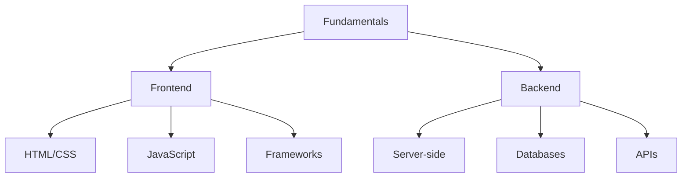
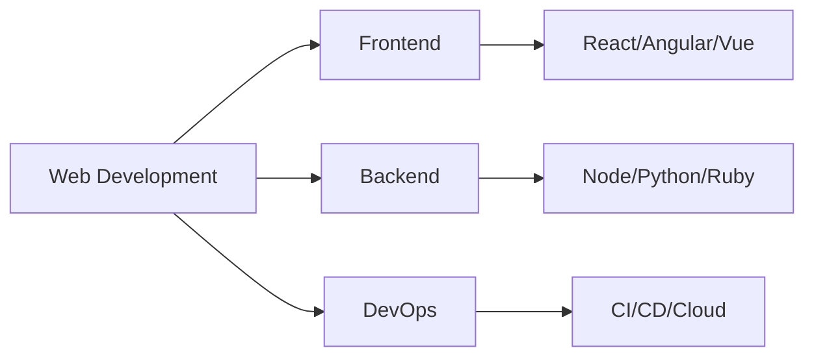
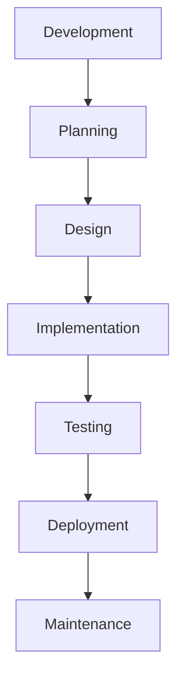
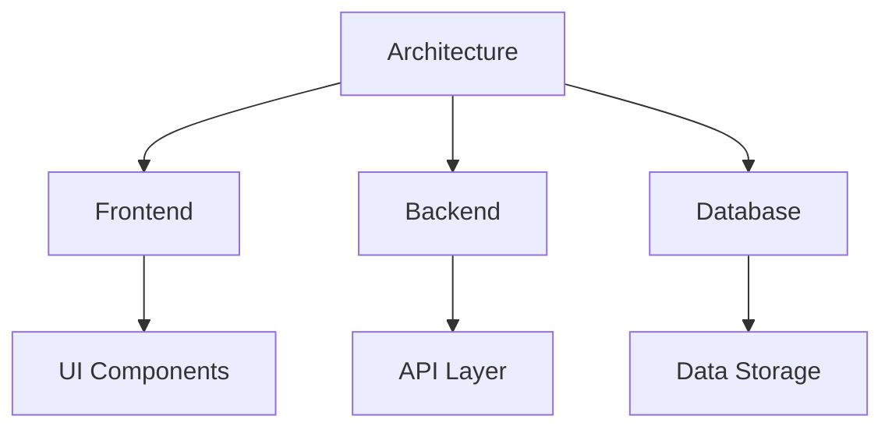

# Web Development Learning Resources

A comprehensive collection of resources for learning web development, covering frontend, backend, and essential practices. This repository provides structured learning paths, practical examples, and curated resources for web developers at all levels.

## ⭐ Give a Star!
If you find this repository helpful or are using it to learn web development, please give it a star. Thanks!

## 📋 Table of Contents
- [Core Areas](#-core-areas)
  - [Frontend Development](#frontend-development)
  - [Backend Development](#backend-development)
  - [Infrastructure & Tools](#infrastructure--tools)
  - [Mobile & Cross-Platform](#mobile--cross-platform)
  - [Quality & Design](#quality--design)
- [How to Use This Repository](#-how-to-use-this-repository)
- [Project Ideas](#-project-ideas)
- [Learning Resources](#-learning-resources)
- [Contributing](#-contributing)
- [License](#-license)

## ⚠️ Disclaimer
> This repository aims to provide a structured learning path for web development and its ecosystem. The content is designed to guide you in understanding core concepts and practical implementation, rather than promoting specific frameworks or tools. Remember that web technologies evolve rapidly - always verify information and stay updated with the latest developments.

## 📊 Development Diagrams

### Learning Path

### Tech Stack

### Development Workflow

### Architecture Pattern

## 📚 Core Areas

### Frontend Development
- [HTML & CSS Resources](./frontend/html-css/README.md)
  - HTML5 Fundamentals
    - Semantic HTML
    - Forms & Validation
    - Media Elements
    - Web Components
  - CSS3 & Responsive Design
    - Flexbox & Grid
    - Media Queries
    - Animations
    - Custom Properties
  - CSS Preprocessors
    - Sass/SCSS
    - Less
    - PostCSS
  - CSS Frameworks
    - Bootstrap
    - Tailwind CSS
    - Material UI
    - Chakra UI

- [JavaScript Resources](./frontend/javascript/README.md)
  - Modern JavaScript (ES6+)
    - Arrow Functions
    - Destructuring
    - Modules
    - Async/Await
  - DOM Manipulation
    - Event Handling
    - DOM API
    - Browser Storage
  - Asynchronous Programming
    - Promises
    - Fetch API
    - WebSockets
  - Browser APIs
    - Web Storage
    - Service Workers
    - WebRTC
    - Web Workers

- [Frontend Frameworks](./frontend/frameworks/README.md)
  - React
    - Hooks
    - Context
    - Redux
    - Next.js
  - Angular
    - Components
    - Services
    - RxJS
    - NgRx
  - Vue.js
    - Composition API
    - Vuex
    - Nuxt.js
  - State Management
    - Redux
    - MobX
    - Zustand
  - Testing
    - Jest
    - Testing Library
    - Cypress
    - Playwright

### Backend Development
- [Node.js Resources](./backend/nodejs/README.md)
  - Express.js
    - Routing
    - Middleware
    - Error Handling
    - Security
  - RESTful APIs
    - API Design
    - Authentication
    - Rate Limiting
    - Documentation
  - Authentication
    - JWT
    - OAuth
    - Passport.js
    - Sessions
  - Database Integration
    - MongoDB
    - PostgreSQL
    - Redis
    - ORMs

- [Python & Django Resources](./backend/python-django/README.md)
  - Django Framework
    - MVT Pattern
    - Admin Interface
    - Forms
    - Templates
  - Django REST Framework
    - Serializers
    - ViewSets
    - Authentication
    - Permissions
  - ORM & Databases
    - Models
    - Queries
    - Migrations
    - Relationships
  - Testing
    - Unit Tests
    - Integration Tests
    - Fixtures
    - Mocking

- [Ruby on Rails Resources](./backend/ruby-rails/README.md)
  - Rails Framework
    - MVC Pattern
    - Routing
    - Controllers
    - Views
  - Active Record
    - Models
    - Migrations
    - Validations
    - Callbacks
  - API Development
    - JSON APIs
    - Authentication
    - Versioning
    - Documentation
  - Testing
    - RSpec
    - Factory Bot
    - Capybara
    - VCR

### Infrastructure & Tools
- [DevOps Guide](./devops/README.md)
  - CI/CD Pipelines
    - GitHub Actions
    - Jenkins
    - CircleCI
    - GitLab CI
  - Containerization
    - Docker
    - Kubernetes
    - Docker Compose
    - Container Registry
  - Cloud Platforms
    - AWS
    - Google Cloud
    - Azure
    - Heroku
  - Infrastructure as Code
    - Terraform
    - Ansible
    - CloudFormation
    - Pulumi

- [Database Guide](./databases/README.md)
  - SQL Databases
    - PostgreSQL
    - MySQL
    - SQLite
    - SQL Server
  - NoSQL Databases
    - MongoDB
    - Redis
    - Cassandra
    - Firebase
  - Database Design
    - Schema Design
    - Normalization
    - Indexing
    - Relationships
  - Query Optimization
    - Performance Tuning
    - Caching
    - Monitoring
    - Backup Strategies

### Mobile & Cross-Platform
- [Mobile Development](./mobile/README.md)
  - Progressive Web Apps
    - Service Workers
    - Web Manifest
    - Offline Support
    - Push Notifications
  - React Native
    - Components
    - Navigation
    - State Management
    - Native Modules
  - Flutter
    - Widgets
    - State Management
    - Navigation
    - Platform Integration

### Quality & Design
- [Testing & QA](./testing/README.md)
  - Unit Testing
    - Jest
    - Mocha
    - PyTest
    - RSpec
  - Integration Testing
    - Supertest
    - TestCafe
    - Cypress
    - Selenium
  - E2E Testing
    - Playwright
    - Cypress
    - Puppeteer
    - WebdriverIO

- [UI/UX Design](./design/README.md)
  - Design Principles
    - Color Theory
    - Typography
    - Layout
    - Responsive Design
  - User Research
    - User Personas
    - User Stories
    - Usability Testing
    - Analytics
  - Design Systems
    - Components
    - Style Guides
    - Documentation
    - Version Control

## 📚 Learning Resources

### YouTube Channels
- [Traversy Media](https://www.youtube.com/user/TechGuyWeb)
- [The Net Ninja](https://www.youtube.com/c/TheNetNinja)
- [Web Dev Simplified](https://www.youtube.com/c/WebDevSimplified)
- [Academind](https://www.youtube.com/c/Academind)
- [Dev Ed](https://www.youtube.com/c/DevEd)
- [JavaScript Mastery](https://www.youtube.com/c/JavaScriptMastery)
- [Fireship](https://www.youtube.com/c/Fireship)
- [Kevin Powell](https://www.youtube.com/kevinpowell) - CSS Expert
- [Ben Awad](https://www.youtube.com/benawad) - Full Stack Development

### Blogs & Newsletters
- [CSS-Tricks](https://css-tricks.com/)
- [Smashing Magazine](https://www.smashingmagazine.com/)
- [Dev.to](https://dev.to/)
- [Medium's Web Development](https://medium.com/topic/web-development)
- [JavaScript Weekly](https://javascriptweekly.com/)
- [Frontend Focus](https://frontendfoc.us/)
- [Node Weekly](https://nodeweekly.com/)
- [React Status](https://react.statuscode.com/)
- [Web.dev](https://web.dev/)

### Podcasts
- [Syntax](https://syntax.fm/)
- [JavaScript Jabber](https://javascriptjabber.com/)
- [ShopTalk Show](https://shoptalkshow.com/)
- [Frontend Happy Hour](https://frontendhappyhour.com/)
- [Full Stack Radio](https://fullstackradio.com/)
- [React Podcast](https://reactpodcast.com/)
- [DevDiscuss](https://dev.to/devdiscuss)
- [CodePen Radio](https://blog.codepen.io/radio/)

### Books
- "Eloquent JavaScript"
- "You Don't Know JS"
- "Clean Code"
- "Design Patterns"
- "Web Performance Fundamentals"
- "Learning React"
- "Node.js Design Patterns"
- "Python Django for Beginners"

### Development Tools
- Code Editors & IDEs
  - Visual Studio Code
  - WebStorm
  - Sublime Text
  - Atom
- Version Control
  - Git
  - GitHub
  - GitLab
  - Bitbucket
- Package Managers
  - npm
  - yarn
  - pip
  - gem
- Development Tools
  - Chrome DevTools
  - Postman
  - Docker
  - Terminal

## 🚀 Project Ideas

### Beginner Projects
- Personal Portfolio
  - Responsive Design
  - Contact Form
  - Project Showcase
- Todo Application
  - CRUD Operations
  - Local Storage
  - Filtering
- Weather App
  - API Integration
  - Geolocation
  - Weather Icons
- Calculator
  - Basic Operations
  - Scientific Functions
  - History
- Blog Platform
  - Content Management
  - Comments
  - User Authentication

### Intermediate Projects
- E-commerce Site
  - Product Catalog
  - Shopping Cart
  - Payment Integration
  - Order Management
- Social Media Clone
  - User Profiles
  - Posts & Comments
  - Real-time Updates
  - File Uploads
- Real-time Chat
  - WebSocket Integration
  - Private Messages
  - Group Chats
  - File Sharing
- Task Management System
  - Project Organization
  - Team Collaboration
  - Task Assignment
  - Progress Tracking
- Recipe Sharing Platform
  - Recipe CRUD
  - Search & Filters
  - User Reviews
  - Image Upload

### Advanced Projects
- Learning Management System
  - Course Management
  - Student Progress
  - Assessments
  - Video Integration
- Project Management Tool
  - Kanban Boards
  - Time Tracking
  - Team Management
  - Reports
- Video Streaming Platform
  - Video Upload
  - Streaming
  - Comments
  - Subscriptions
- Online Code Editor
  - Syntax Highlighting
  - Code Execution
  - File Management
  - Collaboration
- Collaborative Whiteboard
  - Real-time Drawing
  - Shape Tools
  - Chat Integration
  - Session Management

## 🤝 Contributing

Feel free to contribute by:
1. Adding new resources
2. Updating existing materials
3. Fixing errors or broken links
4. Improving documentation
5. Sharing project ideas

Please read our [Contributing Guidelines](CONTRIBUTING.md) before submitting a PR.

## 📝 License

This repository is licensed under the MIT License - see the [LICENSE](LICENSE) file for details.

## 👤 Author & Maintainer

This repository is maintained by [Donnivis Baker](https://github.com/dbsectrainer). For questions or feedback, please open an issue or reach out directly.

---
Last Updated: February 2025
